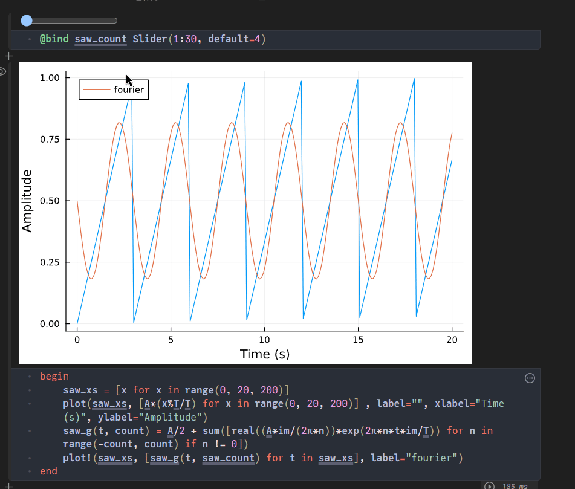
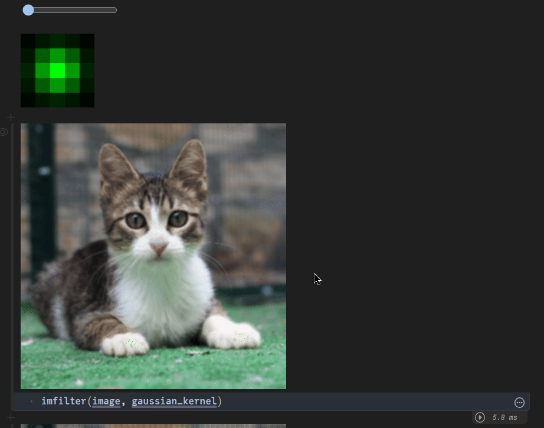

## Math Notebooks

This repo contains Pluto notebooks of my maths musings! 

### Few demos

### How to view?

If you have [Julia](https://julialang.org/) and [Pluto](https://plutojl.org) installed on your system, you can simply copy-paste the link to any of the Julia files into your Pluto notebook console. 

Otherwise, you can use [Binder](https://hub.ovh2.mybinder.org/user/fonsp-pluto-on-binder-un9ly7fc/pluto/?token=Fe4_k8llQPqlrXTCma_ZuQ) to open the notebooks remotely.
